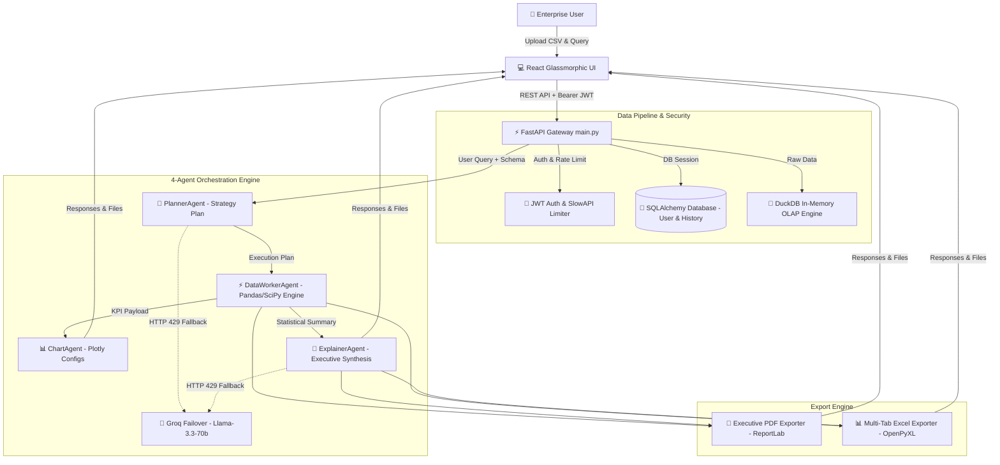

# 🤖 AI Data Dashboard — Enterprise Multi-Agent Analytics Platform

[](https://www.python.org/)
[](https://fastapi.tiangolo.com/)
[](https://react.dev/)
[](https://duckdb.org/)
[](https://www.docker.com/)
[](https://github.com/MuneebMalik244535/AI_Dashboard_Analyzer/actions)
[](LICENSE)

An enterprise-grade, multi-agent AI data intelligence dashboard that analyzes tabular datasets, calculates 100% accurate business metrics in pure Python & DuckDB, renders interactive visualizations, and synthesizes executive business narrative briefings.

---

## 🌟 Platform Capabilities & Architecture Highlights

- 🧠 **4-Agent Collaborative LLM Architecture**:
  - `PlannerAgent`: Formulates analytical strategy JSON plans via Gemini LLM.
  - `DataWorkerAgent`: Executes 100% deterministic Python Pandas & SciPy math (Total Orders, Revenue, Profit, AOV, IQR/Z-score Outliers).
  - `ChartAgent`: Renders responsive Plotly & Recharts visual configurations.
  - `ExplainerAgent`: Synthesizes executive findings & strategic recommendations.
- 🦆 **DuckDB In-Memory OLAP Engine & REST SQL Endpoint**:
  - Sub-second analytical SQL execution over raw datasets via `POST /data/sql`.
- 🔐 **JWT Token Authentication & User Data Isolation**:
  - Stateless JWT token auth (`pyjwt` + `passlib`), password hashing, and user profile isolation.
- 💾 **Persistent Database Layer (SQLAlchemy ORM)**:
  - Persistent SQLite / PostgreSQL database storage for users, sessions, and multi-turn chat history.
- ⚡ **Resilient Multi-Provider LLM Fallback**:
  - Primary API: **Google Gemini API** (`gemini-2.0-flash`).
  - Automatic Failover: **Groq API** (`llama-3.3-70b-versatile`) on HTTP 429 rate limit/quota errors.
- 📄 **Executive Multi-Format Exporters**:
  - One-click downloads for **Executive PDF Summaries (`ReportLab`)**, **Multi-Tab Excel Workbooks (`OpenPyXL`)**, and CSV Data Summaries.
- 🛡️ **Rate Limiting & APM Telemetry**:
  - `slowapi` rate limiting on upload and chat endpoints.
  - Prometheus APM telemetry endpoint (`/metrics`) and structured JSON logging (`structlog`).
- 🧪 **Automated Pytest Suite & GitHub Actions CI**:
  - Complete automated test suite covering auth, data cleaning, agents, and REST endpoints.

---

## 🏛️ Enterprise Architecture Diagram



---

## 🚀 Quick Start (Local Setup)

### 1. Prerequisites
- Python 3.11+
- Node.js 18+ & npm
- Git

### 2. Clone Repository
```bash
git clone https://github.com/MuneebMalik244535/AI_Dashboard_Analyzer.git
cd AI_Dashboard_Analyzer
```

### 3. Environment Setup
Create a `.env` file inside the `backend/` directory based on `.env.example`:
```bash
cp .env.example backend/.env
```
Fill in your API keys inside `backend/.env`:
```env
GEMINI_API_KEY=your_gemini_api_key_here
GEMINI_BASE_URL=https://generativelanguage.googleapis.com/v1beta/openai/
PLANNER_MODEL=gemini-2.0-flash
EXPLAINER_MODEL=gemini-2.0-flash

# Optional Groq Failover
GROQ_API_KEY=your_groq_api_key_here
GROQ_BASE_URL=https://api.groq.com/openai/v1
```

### 4. Run Backend Server & Execute Tests
```bash
cd backend
python -m venv venv
# On Windows: venv\Scripts\activate  |  On Linux/Mac: source venv/bin/activate
pip install -r requirements.txt

# Run automated pytest test suite
pytest tests/ -v

# Start FastAPI server
python main.py
```
The FastAPI backend will start at `http://localhost:8000`.

### 5. Run Frontend Client
Open a new terminal window:
```bash
cd frontend
npm install
npm run dev
```
The Vite frontend will open at `http://localhost:5173`.

---

## 🐳 Running with Docker

```bash
docker-compose up -d --build
```

- **Frontend Application**: `http://localhost:80`
- **Backend API Docs**: `http://localhost:8000/docs`
- **Prometheus Metrics**: `http://localhost:8000/metrics`

---

## 📜 License
This project is licensed under the MIT License — see the [LICENSE](LICENSE) file for details.
