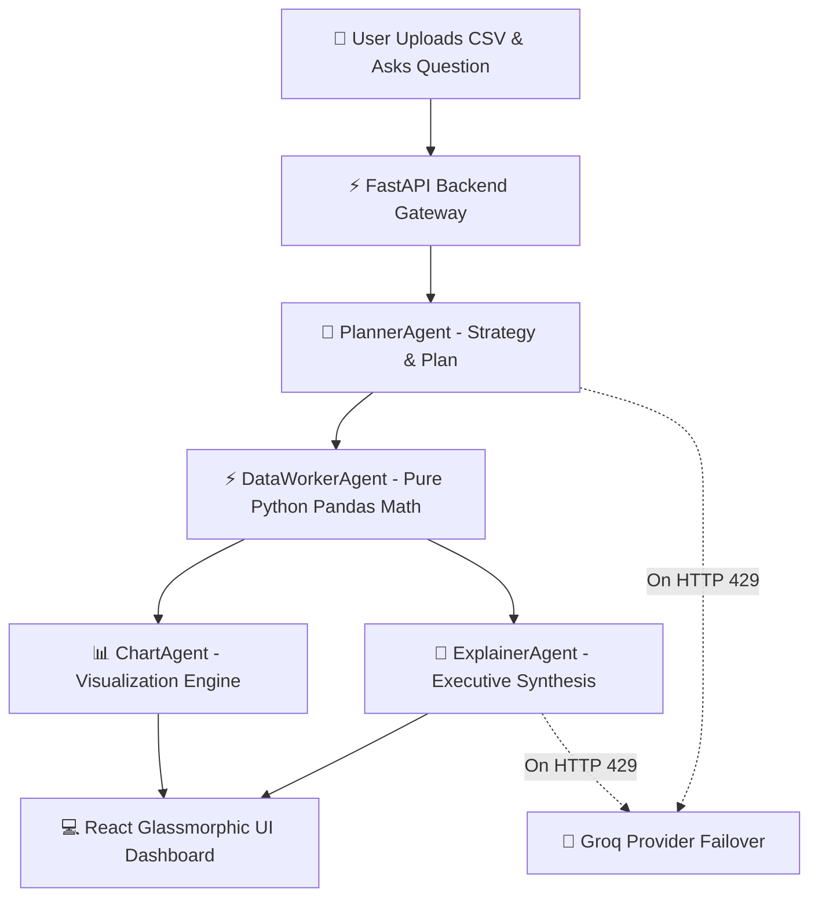

# 🤖 AI Data Dashboard — Multi-Agent Analytics Platform

[](https://www.python.org/)
[](https://fastapi.tiangolo.com/)
[](https://react.dev/)
[](https://www.docker.com/)
[](LICENSE)

An enterprise-grade, multi-agent AI data intelligence dashboard that analyzes CSV datasets, calculates 100% accurate business metrics in pure Python, renders interactive visualizations, and synthesizes executive business narratives.

---

## 🌟 Key Platform Features

- 🧠 **4-Agent Collaborative Architecture**:
  - `PlannerAgent`: Formulates analytical strategy JSON plans via Gemini LLM.
  - `DataWorkerAgent`: Executes 100% deterministic Python Pandas math (Total Orders, Revenue, Profit, AOV, Top Categories).
  - `ChartAgent`: Renders responsive Plotly & Recharts visual configurations.
  - `ExplainerAgent`: Synthesizes executive findings & strategic recommendations.
- ⚡ **Resilient Multi-Provider LLM Fallback**:
  - Primary API: **Google Gemini API** (`base_url="https://generativelanguage.googleapis.com/v1beta/openai/"`).
  - Automatic Failover: **Groq API** (`llama-3.3-70b-versatile` / `llama-3.1-8b-instant`) on HTTP 429 rate limit/quota errors.
- 📊 **Dynamic Dataset Visualizations**:
  - Real-time Area charts, Category Bar charts, Segment Pie charts, and Correlation Scatter plots derived from uploaded CSV data.
- 📄 **Multi-Format Report Export Engine**:
  - One-click downloads for **Executive PDF Summaries**, **Excel/CSV Data Summaries**, **AI Chat Transcripts**, and **Dashboard Snapshots**.
- 🤝 **Live Agent Activity & Inter-Agent Traffic Inspector**:
  - Real-time accordion showing step timings, active model engines, computed KPI payloads, and inter-agent communication messages (`PlannerAgent ➔ DataWorkerAgent ➔ ChartAgent ➔ ExplainerAgent`).

---

## 🏛️ Multi-Agent System Architecture



---

## 🚀 Quick Start (Local Setup)

### 1. Prerequisites
- Python 3.11+
- Node.js 18+ & npm
- Git

### 2. Clone Repository
```bash
git clone https://github.com/YOUR_USERNAME/AI_Data_Dashboard.git
cd AI_Data_Dashboard
```

### 3. Environment Setup
Create a `.env` file inside the `backend/` directory based on `.env.example`:
```bash
cp .env.example backend/.env
```
Fill in your API key inside `backend/.env`:
```env
GEMINI_API_KEY=your_gemini_api_key_here
GEMINI_BASE_URL=https://generativelanguage.googleapis.com/v1beta/openai/
PLANNER_MODEL=gemini-2.0-flash
EXPLAINER_MODEL=gemini-2.0-flash

# Optional Groq Failover
GROQ_API_KEY=your_groq_api_key_here
GROQ_BASE_URL=https://api.groq.com/openai/v1
```

### 4. Run Backend Server
```bash
cd backend
python -m venv venv
# On Windows: venv\Scripts\activate  |  On Linux/Mac: source venv/bin/activate
pip install -r requirements.txt
python main.py
```
The FastAPI backend will start at `http://localhost:8000`.

### 5. Run Frontend Client
Open a new terminal window:
```bash
cd frontend
npm install
npm run dev
```
The Vite frontend will open at `http://localhost:5173`.

---

## 🐳 Running with Docker (1-Command Deployment)

You can run the entire platform (Backend + Frontend) using Docker Compose without installing local Python or Node.js dependencies:

```bash
# Build and start all containers in background
docker-compose up -d --build
```

- **Frontend Application**: `http://localhost:80`
- **Backend API Docs**: `http://localhost:8000/docs`

To stop the containers:
```bash
docker-compose down
```

---

## 📂 Project Structure

```
AI_Data_Dashboard/
├── backend/
│   ├── agents/
│   │   ├── planner_agent.py      # LLM Strategy & Execution Planner
│   │   ├── data_worker_agent.py  # Pure Python Pandas KPI Calculator
│   │   ├── chart_agent.py        # Plotly & Visualization Engine
│   │   └── explainer_agent.py    # Executive Synthesis Agent
│   ├── utils/
│   │   ├── ai_client.py          # OpenAI SDK Factory with Gemini + Groq Failover
│   │   ├── agent_coordinator.py  # 4-Agent Pipeline & Traffic Coordinator
│   │   └── file_handler.py       # 4-Step Automated Data Cleaning Pipeline
│   ├── main.py                   # FastAPI REST Endpoints
│   ├── requirements.txt          # Python Dependencies
│   └── Dockerfile                # Backend Docker Configuration
├── frontend/
│   ├── src/
│   │   ├── App.tsx               # Main Glassmorphic Dashboard UI & Pages
│   │   ├── api.ts                # API Integration Service
│   │   └── context/AppContext.tsx# Global State Provider
│   ├── package.json
│   └── Dockerfile                # Frontend Nginx Docker Configuration
├── docker-compose.yml            # Multi-Container Docker Orchestrator
├── .env.example                  # Environment Variables Template
├── .gitignore                    # Git Ignore Safeguards
└── README.md                     # Platform Documentation
```

---

## 📜 License
This project is licensed under the MIT License — see the [LICENSE](LICENSE) file for details.
