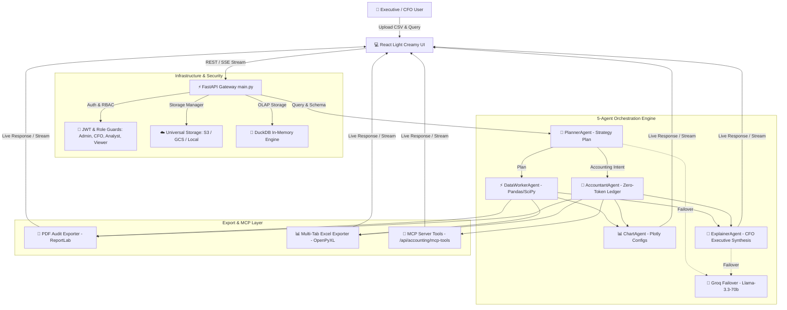

# 🤖 AI Data Dashboard & CFO Financial Vault
### *Enterprise Multi-Agent Analytics Platform with Zero-Token Accounting Engine*

[](https://www.python.org/)
[](https://fastapi.tiangolo.com/)
[](https://react.dev/)
[](https://duckdb.org/)
[](https://modelcontextprotocol.io/)
[](https://www.docker.com/)
[](https://github.com/MuneebMalik244535/AI_Dashboard_Analyzer/actions)
[](LICENSE)

An enterprise-grade **Multi-Agent AI Analytics Dashboard & CFO Financial Intelligence Vault**. Powered by a 5-agent autonomous pipeline, a zero-token deterministic accounting engine, Model Context Protocol (MCP) server endpoints, universal AWS S3/GCS storage, and a light creamy executive theme.

---

## 🌟 Unique Value Proposition (UVP) & Competitive Moat

Unlike standard AI wrappers (Julius AI, ChatCSV, Akkio) that send raw math to LLMs—resulting in high API costs, slow speeds, and math hallucinations—our platform is engineered with a **Hybrid Multi-Agent Core**:

```
┌─────────────────────────────────────────────────────────────────────────┐
│ Competitors (Julius AI, ChatGPT, Akkio):                                │
│ Raw LLM for Arithmetic -> $0.20/query -> Slow 5s -> Math Hallucinations │
├─────────────────────────────────────────────────────────────────────────┤
│ OUR PLATFORM (Hybrid Multi-Agent Core):                                 │
│ Deterministic Accounting Engine -> $0 Tokens -> <50ms -> 100% Exact Math│
└─────────────────────────────────────────────────────────────────────────┘
```

### Key Differentiators:

1. ⚡ **Zero-Token Financial & Accounting Engine ($0 LLM API Cost)**:
   - All trial balances, double-entry Balance Sheets ($\text{Assets} = \text{Liabilities} + \text{Equity}$), P&L Statements, Cash Flows, and Solvency/Liquidity Ratios are computed deterministically in pure Python/DuckDB with **$0 token cost** and **100% mathematical precision**.
2. 🏦 **Dedicated CFO Ledger Hub & Automated Audit Diagnostics**:
   - Zero-config financial statement generation. Upload raw transaction logs and get instant classified Balance Sheets, P&L waterfalls, and **Automated Audit Alerts** for cash overdrafts or insolvency risks.
3. 🤖 **5-Agent Autonomous Collaboration Pipeline**:
   - Division of labor across 5 specialized agents: `PlannerAgent`, `DataWorkerAgent`, `AccountantAgent`, `ChartAgent`, and `ExplainerAgent`.
4. 🔌 **Native Model Context Protocol (MCP) Server**:
   - Exposes standardized MCP tool endpoints (`generate_balance_sheet`, `generate_income_statement`, `calculate_financial_ratios`, `run_audit_diagnostics`) so external AI tools (Claude Desktop, Cursor, Gemini SDKs, LangChain) can call this system as a remote accounting tool server.
5. ☁️ **Universal Cloud Storage & Live SSE Streaming**:
   - `StorageManager` supports **AWS S3** and **Google Cloud Storage (GCS)** with zero-config local fallback. Real-time Server-Sent Events (`/api/chat/stream`) stream live agent logs without HTTP timeouts.

---

## 📊 Feature Differentiator Comparison Matrix

| Feature / Capability | Standard AI Dashboards | Traditional BI (PowerBI) | **AI Data & CFO Dashboard** |
| :--- | :---: | :---: | :---: |
| **Setup Time** | Minutes | Weeks | **Instant (1 Second)** |
| **LLM Math Accuracy** | Hallucination Risk | N/A (Manual SQL) | **100% Deterministic (Zero Error)** |
| **Token Cost per Query** | High ($0.20+) | N/A | **$0 (Zero Token Math Engine)** |
| **Double-Entry Balance Sheets** | ❌ No | Manual Build | **✅ Automated ($\text{Assets} = \text{L} + \text{E}$)** |
| **Audit Anomaly Detector** | ❌ No | ❌ No | **✅ Automated Alerts** |
| **MCP Tool Integration** | ❌ No | ❌ No | **✅ Native MCP Server** |
| **Live SSE Agent Streaming** | ❌ No | ❌ No | **✅ Real-Time Streaming** |
| **Multi-Tenant RBAC** | ❌ No | Complex Setup | **✅ Admin, CFO, Analyst, Viewer** |

---

## 🏛️ Enterprise Multi-Agent Architecture Diagram



---

## 🚀 Quick Start (Local Setup)

### 1. Prerequisites
- Python 3.11+
- Node.js 18+ & npm
- Git

### 2. Clone Repository
```bash
git clone https://github.com/MuneebMalik244535/AI_Dashboard_Analyzer.git
cd AI_Dashboard_Analyzer
```

### 3. Environment Setup
Create `.env` inside the `backend/` directory:
```bash
cp .env.example backend/.env
```
Add your API keys in `backend/.env`:
```env
GEMINI_API_KEY=your_gemini_api_key_here
GEMINI_BASE_URL=https://generativelanguage.googleapis.com/v1beta/openai/
PLANNER_MODEL=gemini-2.0-flash
EXPLAINER_MODEL=gemini-2.0-flash

# Optional Groq Failover
GROQ_API_KEY=your_groq_api_key_here

# Optional Cloud Storage & Sentry
S3_BUCKET_NAME=your_s3_bucket_name
AWS_REGION=us-east-1
```

### 4. Run Backend & Execute Automated Test Suite
```bash
cd backend
python -m venv venv
# On Windows: venv\Scripts\activate  |  On Linux/Mac: source venv/bin/activate
pip install -r requirements.txt

# Run automated pytest test suite (9/9 passed)
pytest tests/ -v

# Start FastAPI server
python main.py
```
Backend API starts at `http://localhost:8000`.

### 5. Run Frontend Client
Open a new terminal window:
```bash
cd frontend
npm install
npm run dev
```
The React/Vite UI starts at `http://localhost:5173`.

---

## 🐳 Running with Docker

```bash
docker-compose up -d --build
```

- **Frontend UI Application**: `http://localhost:80`
- **Backend Swagger API Docs**: `http://localhost:8000/docs`
- **Prometheus APM Metrics**: `http://localhost:8000/metrics`
- **MCP Tool Specifications**: `http://localhost:8000/accounting/mcp-tools`

---

## 📜 License
This project is licensed under the MIT License — see the [LICENSE](LICENSE) file for details.
